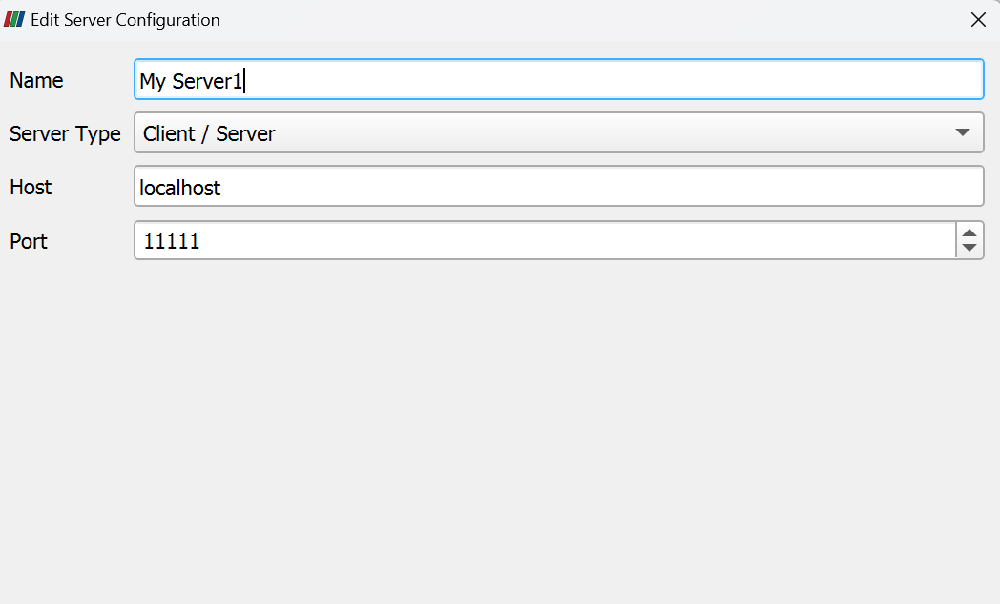

## how to use it with Jarvis in cluster

### set the environment
load paraview and openmpi
```
module load paraview
spack load openmpi

```
### create jarvis pipeline
```
jarvis ppl create paraview
jarvis ppl env build
jarvis ppl append paraview port_id=11111
```
Note: If the connect has issues, try change the port_id first, for example change the port_id to 11112. 
### run the application
```
jarvis ppl run
```

## How to use it in local computer 
###
Run this command in local terminal:
```
ssh -N -L 11111:localhost:11111 your_id@ares.cs.iit.edu
```
In local paraview, following these instructions:
File -> connect </br>


Once coonect the server, The remote paraview are good to go.

