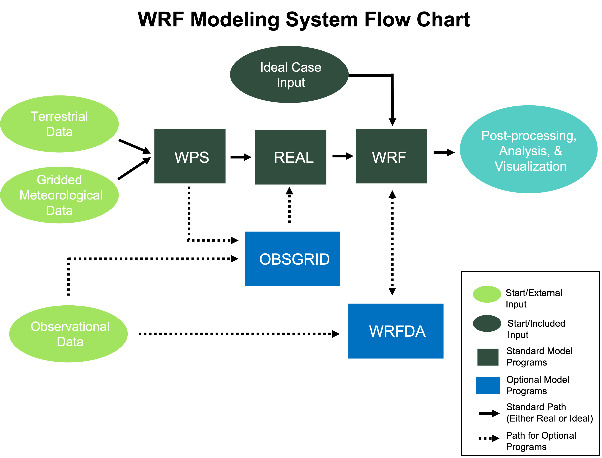

# WRF 

## what is the WRF application?
WRF is a state-of-the-art atmospheric modeling system designed for both meteorological research and numerical weather prediction. It offers a host of options for atmospheric processes and can run on a variety of computing platforms. WRF excels in a broad range of applications across scales ranging from tens of meters to thousands of kilometers, including the following.

– Meteorological studies
– Real-time NWP
– Idealized simulations
– Data assimilation
– Earth system model coupling
– Model training and educational support

Here is the workflow for the WRF.

As shown in the diagram, the WRF Modeling System consists of the following programs.

### WRF Preprocessing System (WPS) (WPS)

### Initialization (Real and Ideal)

### WRF-ARW Solver (WRF)

### WRF Data Assimilation (WRFDA) (WRFDA)

### Post-processing, Analysis, and Visualization Tools

### WRF Preprocessing System (WPS)
The WPS is used for real-data simulations. Its functions are to 1) define simulation domains; 2) interpolate terrestrial data (e.g., terrain, landuse, and soil types) to the simulation domain; and 3) degrib and interpolate meteorological input data from an outside model to the simulation domain.

### Initialization
The WRF model is capable of simulating both real- and ideal-data cases. ideal.exe is a program that simulates in a controlled environment. Idealized simulations are initiated from an included initial condition file from an existing sounding, and assumes a simplified orography. Real-data cases use output from the WPS, which includes meteorological input originally generated from a previously-run external analysis or forecast model (e.g., GFS) as input to the real.exe program.

### WRF Data Assimilation (WRFDA)
WRF Data Assimilation (WRFDA) is an optional program used to ingest observations into interpolated analysis created by WPS. It may also be used to update the WRF model’s initial conditions by running in “cycling” mode. WRFDA’s primary features are:

The capability of 3D and 4D hybrid data assimilation (Variational + Ensemble)

Based on an incremental variational data assimilation technique

Tangent linear and adjoint of WRF are fully integrated with WRF for 4D-Var

Utilizes the conjugate gradient method to minimize cost function in the analysis control variable space

Analysis on an un-staggered Arakawa A-grid

Analysis increments interpolated to staggered Arakawa C-grid, which is then added to the background (first guess) to get the final analysis of the WRF-model grid

Conventional observation data input may be supplied in either ASCII format via the obsproc utility, or PREPBUFR format

Multiple-satellite observation data input may be supplied in BUFR format

Two fast radiative transfer models, CRTM and RTTOV, are interfaced to WRFDA to serve as satellite radiance observation operator

Variational bias correction for satellite radiance data assimilation

All-sky radiance data assimilation capability

Multiple radar data (reflectivity & radial velocity) input is supplied through ASCII format

Multiple outer loop to address nonlinearity

### Post-processing, Analysis, and Visualization Tools
Several post-processing programs are supported, including RIP (based on NCAR Graphics), NCAR Graphics Command Language (NCL), and conversion programs for other readily-available graphics packages (e.g., GrADS).

### wrf-python (wrf-python) 
is a collection of diagnostic and interpolation routines for use with output from the WRF model.

### NCL (NCAR Command Language) 
is a free, interpreted language designed specifically for scientific data processing and visualization. NCL has robust file input and output. It can read in netCDF, HDF4, HDF4-EOS, GRIB, binary and ASCII data. The graphics are world-class and highly customizable.

### RIP (Read/Interpolate/Plot) 
is a Fortran program that invokes NCAR Graphics routines for the purpose of visualizing output from gridded meteorological data sets, primarily from mesoscale numerical models.

### ARWpost 
is a package that reads-in WRF-ARW model data and creates GrADS output files.

## what this application generate:
For researchers, WRF can produce simulations based on actual atmospheric conditions (i.e., from observations and analyses) or idealized conditions. WRF offers operational forecasting a flexible and computationally-efficient platform, while reflecting recent advances in physics, numerics, and data assimilation contributed by developers from the expansive research community. WRF is currently in operational use at NCEP and other national meteorological centers as well as in real-time forecasting configurations at laboratories, universities, and companies. WRF has a large worldwide community of registered users, and NCAR provides regular workshops and tutorials on it.

###  Key Input Parameters (WRF)

# WRF Namelist Configuration: &time_control

This document provides a detailed overview of the parameters found in the `&time_control` section of the WRF `namelist.input` file. These settings govern the simulation timing, duration, input/output (I/O) operations, and restart capabilities.

---

##  Simulation Time & Duration

These parameters define the total length and the specific start/end dates of the simulation.

| Namelist Parameter | Default Setting | Description | Domain Scope |
| :--- | :--- | :--- | :--- |
| **`run_days`** | `0` | Simulation length in days. | Single Entry |
| **`run_hours`** | `0` | Simulation length in hours. | Single Entry |
| **`run_minutes`** | `0` | Simulation length in minutes. | Single Entry |
| **`run_seconds`** | `0` | Simulation length in seconds. Use any combination of `run_*` for the full duration. | Single Entry |
| **`start_year`** | `2019` | 4-digit year for the simulation start time. | Per Domain (`max_dom`) |
| **`start_month`** | `09` | 2-digit month for the simulation start time. | Per Domain (`max_dom`) |
| **`start_day`** | `04` | 2-digit day for the simulation start time. | Per Domain (`max_dom`) |
| **`start_hour`** | `12` | 2-digit hour for the simulation start time. | Per Domain (`max_dom`) |
| **`start_minute`** | `0` | 2-digit minute for the simulation start time. | Per Domain (`max_dom`) |
| **`start_second`** | `0` | 2-digit second for the simulation start time. | Per Domain (`max_dom`) |
| **`end_year`** | `2019` | 4-digit year for the simulation end time. | Per Domain (`max_dom`) |
| **`end_month`** | `09` | 2-digit month for the simulation end time. | Per Domain (`max_dom`) |
| **`end_day`** | `06` | 2-digit day for the simulation end time. | Per Domain (`max_dom`) |
| **`end_hour`** | `00` | 2-digit hour for the simulation end time. | Per Domain (`max_dom`) |
| **`end_minute`** | `0` | 2-digit minute for the simulation end time. | Per Domain (`max_dom`) |
| **`end_second`** | `0` | 2-digit second for the simulation end time. | Per Domain (`max_dom`) |
| **`interval_seconds`**| `10800` | Time interval (seconds) between lateral boundary condition files from WPS. | Single Entry |

> **Note:** `run_*` parameters take precedence in `wrf.exe`, while `real.exe` uses `start_*` and `end_*` times.

---

##  File I/O and History

Controls for writing history output files (e.g., `wrfout_d<domain>_<date>`).

| Namelist Parameter | Default Setting | Description | Domain Scope |
| :--- | :--- | :--- | :--- |
| **`history_interval`** | `60` | Frequency (minutes) for writing to history files. `_d/h/m/s` can be used. | Per Domain (`max_dom`) |
| **`history_begin`** | `0` | Time (minutes) from run start to begin writing history files. `_d/h/m/s` can be used. | Per Domain (`max_dom`) |
| **`frames_per_outfile`** | `1` | Number of history output times to bundle into a single output file. | Per Domain (`max_dom`) |
| **`output_ready_flag`** | `.true.` | Writes an empty `wrfoutReady_d<domain>` file for post-processing scripts to check completion. | Single Entry |
| **`io_form_history`** | `2` | I/O format for history files. Common options include:   • **2**: netCDF   • **11**: Parallel netCDF   • **102**: Split netCDF files (one per processor) | Single Entry |

---

##  Restart Controls

Parameters to manage simulation restarts from a previous state.

| Namelist Parameter | Default Setting | Description | Domain Scope |
| :--- | :--- | :--- | :--- |
| **`restart`** | `.false.` | Set to `.true.` if this is a restart simulation. | Single Entry |
| **`restart_interval`** | `1440` | Interval (minutes) for writing restart files (`wrfrst_*`). | Single Entry |
| **`override_restart_intervals`** | `.false.` | If `.true.`, uses this namelist's `restart_interval` instead of the one in the `wrfrst` file. | Single Entry |
| **`write_hist_at_0h_rst`** | `.false.` | If `.true.`, a history file will be written at the initial time of a restart run. | Single Entry |
| **`reset_simulation_start`** | `.false.` | If `.true.`, overwrites the simulation start date with the forecast start time from the restart file. | Single Entry |
| **`io_form_restart`**| `2` | I/O format for restart files. Options are similar to `io_form_history`. | Single Entry |

---

##  Input/Output Naming and Formatting

Define the names and formats of auxiliary input and output files.

| Namelist Parameter | Default Setting | Description | Domain Scope |
| :--- | :--- | :--- | :--- |
| **`input_from_file`** | `.true.` | Whether to use input files for nested domains. | Per Domain (`max_dom`) |
| **`fine_input_stream`** | `0` | Selects fields for nest initialization.   • **0**: All fields are used.   • **2**: Only fields from input stream 2 are used. | Per Domain (`max_dom`) |
| **`auxinput1_inname`**| `met_em.d<domain>.<date>` | Name of the input file from WPS. | Single Entry |
| **`auxinput4_inname`**| `wrflowinp_d<domain>` | Name of the input file for the lower boundary (e.g., SST). | Single Entry |
| **`auxinput4_interval`**| `360` | Interval (minutes) for the lower boundary file when `sst_update=1`. | Per Domain (`max_dom`) |
| **`io_form_input`** | `2` | I/O format of the input (`met_em`) files. | Single Entry |
| **`io_form_boundary`**| `2` | I/O format of the boundary (`wrfbdy`) files. | Single Entry |
| **`io_form_auxinput2`**| `2` | I/O format for auxiliary input stream 2. | Single Entry |
| **`auxhist9_outname`**| `auxhist9_d<domain>_<date>` | File name for auxiliary history output stream 9. | Single Entry |
| **`auxhist9_interval`**| `10` | Interval (minutes) for auxiliary history output stream 9. | Per Domain (`max_dom`) |
| **`nocolons`** | `.false.` | If `.true.`, replaces colons (`:`) with underscores (`_`) in output filenames. | Single Entry |

---

##  Diagnostics and Debugging

Options for enabling diagnostic print-outs and debugging information.

| Namelist Parameter | Default Setting | Description | Domain Scope |
| :--- | :--- | :--- | :--- |
| **`diag_print`** | `0` | Prints time series model diagnostics.   • **0**: No print.   • **1**: Prints domain-averaged pressure tendencies.   • **2**: Option 1 plus rainfall and heat fluxes. | Single Entry |
| **`debug_level`** | `0` | Increases debugging print-outs. Higher values (e.g., `50`, `200`) produce more verbose output. | Single Entry |
| **`output_diagnostics`**| `0` | Set to `1` to add 48 surface diagnostic arrays (max/min/mean/std) to the output. | Single Entry |
| **`nwp_diagnostics`** | `0` | Set to `1` to add several NWP diagnostic fields to the output file. | Single Entry |